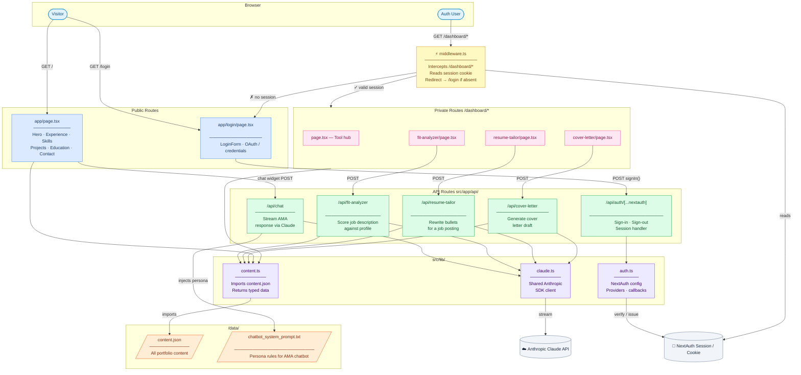

# Portfolio Architecture

## Overview

Next.js 14 App Router portfolio with a public-facing site, an AMA chatbot, and an
auth-gated dashboard of AI tools. All content is sourced from `data/content.json`
with no database. AI features call the Anthropic Claude API via a shared SDK client.

---

## System Diagram



---

## Layer Reference

| Layer | Color | Responsibility |
|---|---|---|
| Browser | Blue | Entry point — visitor vs authenticated user |
| Edge (middleware) | Yellow | Auth gate — runs before any page renders |
| Public Routes | Light blue | Freely accessible pages, no session required |
| Private Routes | Pink | Dashboard tools — blocked without valid session |
| API Routes | Green | Server-side AI logic, one route per feature |
| Shared Lib | Purple | SDK client, typed content loader, NextAuth config |
| Data | Orange | `content.json` and system prompt — no database |
| External | Grey | Anthropic Claude API and NextAuth session store |

---

## Key Data Flows

**Auth flow**
```
Auth User → middleware.ts → reads SESSION cookie
  ├── valid  → /dashboard/*
  └── absent → /login → /api/auth/[...nextauth] → issues SESSION
```

**AI tool flow**
```
Dashboard page → POST /api/<tool>
  → injects content.json profile via content.ts
  → claude.ts (shared SDK client)
  → Anthropic Claude API (streamed response)
  → back to page
```

**AMA chatbot flow**
```
Chat widget on homepage → POST /api/chat
  → injects chatbot_system_prompt.txt (persona rules)
  → claude.ts → Anthropic Claude API (streamed)
  → message bubbles rendered in ChatWindow
```

**Content render flow**
```
Any page (public or private)
  → lib/content.ts at build / request time
  → imports data/content.json
  → typed data passed to section / card components
```

---

## File Structure

```
myportfolio/
├── data/
│   ├── content.json                          # source of truth for all portfolio content
│   └── chatbot_system_prompt.txt             # persona instructions for the AMA chatbot
│
├── public/
│   ├── profile.jpg                           # hero profile photo
│   └── og-image.png                          # social share preview image
│
├── src/
│   ├── middleware.ts                         # intercepts /dashboard/* — redirects unauthenticated users to /login
│   │
│   ├── app/
│   │   ├── layout.tsx                        # root HTML shell — fonts, metadata, ChatWidget mount point
│   │   ├── page.tsx                          # homepage — assembles all public sections in order
│   │   ├── globals.css                       # global styles and CSS custom properties
│   │   ├── loading.tsx                       # homepage skeleton shown during server render
│   │   ├── not-found.tsx                     # custom 404 page
│   │   │
│   │   ├── login/
│   │   │   └── page.tsx                      # public login page — renders LoginForm
│   │   │
│   │   ├── dashboard/
│   │   │   ├── layout.tsx                    # auth guard — checks session, redirects to /login if absent
│   │   │   ├── page.tsx                      # dashboard home — cards linking to each tool
│   │   │   ├── fit-analyzer/
│   │   │   │   └── page.tsx                  # job fit scoring tool page
│   │   │   ├── resume-tailor/
│   │   │   │   └── page.tsx                  # resume bullet tailoring tool page
│   │   │   └── cover-letter/
│   │   │       └── page.tsx                  # cover letter generation tool page
│   │   │
│   │   └── api/
│   │       ├── chat/
│   │       │   └── route.ts                  # POST — streams Claude AMA response using chatbot_system_prompt
│   │       ├── fit-analyzer/
│   │       │   └── route.ts                  # POST — scores a job description against content.json profile
│   │       ├── resume-tailor/
│   │       │   └── route.ts                  # POST — rewrites experience bullets to match a job posting
│   │       ├── cover-letter/
│   │       │   └── route.ts                  # POST — generates a cover letter from job post + content.json
│   │       └── auth/
│   │           └── [...nextauth]/
│   │               └── route.ts              # NextAuth catch-all — handles sign-in, sign-out, session
│   │
│   ├── components/
│   │   ├── layout/
│   │   │   ├── Navbar.tsx                    # fixed top nav with smooth-scroll links to each section
│   │   │   └── Footer.tsx                    # email, LinkedIn, GitHub links and copyright
│   │   │
│   │   ├── sections/
│   │   │   ├── HeroSection.tsx               # name, title, pitch, profile image, and CTA buttons
│   │   │   ├── ExperienceSection.tsx         # section heading + maps experience[] to ExperienceCard
│   │   │   ├── SkillsSection.tsx             # section heading + maps skills.categories to SkillCategory
│   │   │   ├── ProjectsSection.tsx           # section heading + maps projects[] to ProjectCard
│   │   │   ├── EducationSection.tsx          # section heading + maps education[] to EducationCard
│   │   │   └── ContactSection.tsx            # email, phone, LinkedIn, and GitHub contact links
│   │   │
│   │   ├── cards/
│   │   │   ├── ExperienceCard.tsx            # single job entry — company, title, dates, bullets list
│   │   │   ├── ProjectCard.tsx               # single project — name, description, stack badges, impact
│   │   │   └── EducationCard.tsx             # single degree — institution, dates, GPA, honors
│   │   │
│   │   ├── skills/
│   │   │   ├── SkillCategory.tsx             # one category block — name heading + row of SkillPills
│   │   │   └── SkillPill.tsx                 # individual skill tag pill
│   │   │
│   │   ├── chatbot/
│   │   │   ├── ChatWidget.tsx                # floating button — toggles ChatWindow open/closed
│   │   │   ├── ChatWindow.tsx                # full chat panel — scrollable message list + ChatInput
│   │   │   ├── ChatMessage.tsx               # single message bubble — user and assistant variants
│   │   │   └── ChatInput.tsx                 # textarea + send button, calls /api/chat
│   │   │
│   │   ├── dashboard/
│   │   │   ├── DashboardNav.tsx              # sidebar navigation linking to the three tools
│   │   │   ├── FitAnalyzer.tsx               # job description textarea + fit score + gap breakdown output
│   │   │   ├── ResumeTailor.tsx              # job post input + tailored bullet points output with copy button
│   │   │   └── CoverLetterGenerator.tsx      # job post + tone selector inputs + generated letter output
│   │   │
│   │   ├── auth/
│   │   │   └── LoginForm.tsx                 # credential or OAuth sign-in form, calls NextAuth signIn()
│   │   │
│   │   └── ui/
│   │       ├── Button.tsx                    # button with variant props (primary, secondary, ghost)
│   │       ├── Card.tsx                      # container with border, shadow, and padding
│   │       ├── Section.tsx                   # section wrapper — sets id anchor, heading, vertical padding
│   │       ├── Badge.tsx                     # small inline label for stack tags and types
│   │       └── Spinner.tsx                   # animated loading indicator for async API calls
│   │
│   ├── lib/
│   │   ├── content.ts                        # imports and re-exports content.json with TypeScript types
│   │   ├── claude.ts                         # shared Anthropic SDK client instance used by all API routes
│   │   └── auth.ts                           # NextAuth config — providers, session strategy, callbacks
│   │
│   └── types/
│       └── content.ts                        # TypeScript interfaces mirroring the content.json schema
│
├── .env.local                                # ANTHROPIC_API_KEY, NEXTAUTH_SECRET, NEXTAUTH_URL (not committed)
├── next.config.ts                            # Next.js config
├── tailwind.config.ts                        # Tailwind theme config
├── tsconfig.json                             # TypeScript config
└── package.json                              # dependencies and scripts
```
