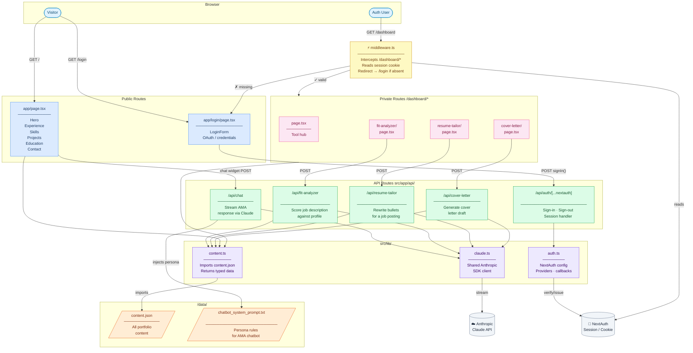

# Portfolio Architecture

```mermaid
flowchart TB
    classDef browser  fill:#e0f2fe,stroke:#0284c7,color:#0c4a6e
    classDef edge     fill:#fef9c3,stroke:#ca8a04,color:#713f12
    classDef public   fill:#dbeafe,stroke:#3b82f6,color:#1e3a5f
    classDef private  fill:#fce7f3,stroke:#ec4899,color:#831843
    classDef api      fill:#dcfce7,stroke:#16a34a,color:#14532d
    classDef lib      fill:#ede9fe,stroke:#7c3aed,color:#3b0764
    classDef data     fill:#ffedd5,stroke:#ea580c,color:#7c2d12
    classDef external fill:#f1f5f9,stroke:#64748b,color:#1e293b

    %% ── Browser ──────────────────────────────────────────────────
    subgraph BROWSER["  Browser  "]
        V(["Visitor"]):::browser
        AU(["Auth User"]):::browser
    end

    %% ── Edge ─────────────────────────────────────────────────────
    MW["⚡ middleware.ts
    ─────────────────
    Intercepts /dashboard/*
    Reads session cookie
    Redirect → /login if absent"]:::edge

    %% ── Public routes ────────────────────────────────────────────
    subgraph PUBLIC["  Public Routes  "]
        HP["app/page.tsx
        ────────────
        Hero
        Experience
        Skills
        Projects
        Education
        Contact"]:::public

        LG["app/login/page.tsx
        ─────────────────
        LoginForm
        OAuth / credentials"]:::public
    end

    %% ── Private routes ───────────────────────────────────────────
    subgraph PRIVATE["  Private Routes  /dashboard/*  "]
        DB["page.tsx
        ─────────
        Tool hub"]:::private

        FA["fit-analyzer/
        page.tsx"]:::private

        RT["resume-tailor/
        page.tsx"]:::private

        CL["cover-letter/
        page.tsx"]:::private
    end

    %% ── API routes ───────────────────────────────────────────────
    subgraph API["  API Routes  src/app/api/  "]
        CHAT["/api/chat
        ─────────────
        Stream AMA
        response via Claude"]:::api

        FAPI["/api/fit-analyzer
        ──────────────────
        Score job description
        against profile"]:::api

        RAPI["/api/resume-tailor
        ──────────────────
        Rewrite bullets
        for a job posting"]:::api

        CLAPI["/api/cover-letter
        ─────────────────
        Generate cover
        letter draft"]:::api

        NAPI["/api/auth/[...nextauth]
        ────────────────────────
        Sign-in · Sign-out
        Session handler"]:::api
    end

    %% ── Shared lib ───────────────────────────────────────────────
    subgraph LIB["  src/lib/  "]
        CT["content.ts
        ──────────
        Imports content.json
        Returns typed data"]:::lib

        SDK["claude.ts
        ──────────
        Shared Anthropic
        SDK client"]:::lib

        AUTHCFG["auth.ts
        ────────
        NextAuth config
        Providers · callbacks"]:::lib
    end

    %% ── Data ─────────────────────────────────────────────────────
    subgraph DATA["  /data/  "]
        JSON[/"content.json
        ─────────────
        All portfolio
        content"/]:::data

        SYSP[/"chatbot_system_prompt.txt
        ──────────────────────────
        Persona rules
        for AMA chatbot"/]:::data
    end

    %% ── External ─────────────────────────────────────────────────
    CLAUDE[("☁️ Anthropic
    Claude API")]:::external

    SESSION[("🔐 NextAuth
    Session / Cookie")]:::external

    %% ── Flows ────────────────────────────────────────────────────

    %% Browser → routes
    V      -- "GET /"          --> HP
    V      -- "GET /login"     --> LG
    AU     -- "GET /dashboard" --> MW
    MW     -- "✓ valid"        --> PRIVATE
    MW     -- "✗ missing"      --> LG

    %% Pages → API
    HP     -- "chat widget POST"  --> CHAT
    FA     -- "POST"              --> FAPI
    RT     -- "POST"              --> RAPI
    CL     -- "POST"              --> CLAPI
    LG     -- "POST signIn()"     --> NAPI

    %% API → lib
    CHAT  --> SDK
    FAPI  --> SDK
    RAPI  --> SDK
    CLAPI --> SDK
    NAPI  --> AUTHCFG

    %% Lib → external
    SDK     -- "stream"        --> CLAUDE
    AUTHCFG -- "verify/issue"  --> SESSION
    MW      -- "reads"         --> SESSION

    %% API → data
    CHAT  -- "injects persona"  --> SYSP
    FAPI  --> CT
    RAPI  --> CT
    CLAPI --> CT

    %% Pages → data (server-side render)
    HP      --> CT
    PRIVATE --> CT

    %% Lib → data
    CT -- "imports" --> JSON
```
